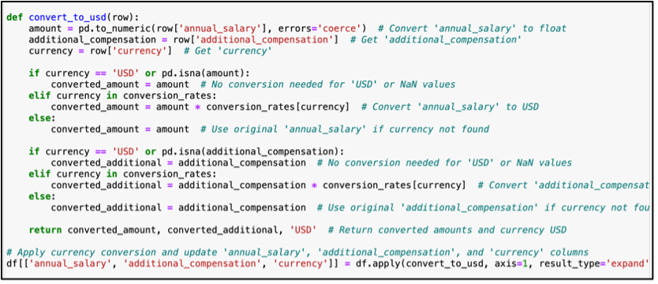

# DataCleaningProject

# Salary Survey Dataset Analysis

## Dataset Information
- **Dataset Origin:** The dataset being used is a Salary Survey from AskAManager.org, a popular advice column and blog run by Alison Green.
- **Dataset Source:** The dataset can be found at [https://oscarbaruffa.com/messy/](https://oscarbaruffa.com/messy/).
- **Description:** The dataset primarily focuses on salary-related information but also includes additional demographic and professional details. It contains 28035 rows and 17 columns. Notably, 6 of the variables involve free-form text entry.

## 1. Dataset Fitness Assessment
### Criteria for Fitness:
1. **Relevance to Analysis Goals:** The dataset's relevance to our analysis goals is paramount to ensure effective analysis.
2. **Currency Standardization:** Currency standardization is essential for accurate comparison and interpretation of salary data across different regions.
3. **Domain-specific Considerations:** Understanding industry norms and regional variations is crucial for accurate interpretation.

### Assessment:
- The dataset appears to align well with our analysis goals.
- Currency standardization and domain-specific considerations will be necessary for meaningful analysis.

## 2. Cleaning Steps
### 1. Renaming Columns:
- Column renaming was performed for clarity and consistency across variables.

### 2. Dropping Columns:
- Redundant or irrelevant columns were dropped to streamline the dataset.

### 3. Handling Missing Values:
- Missing values were addressed through imputation techniques to maintain data integrity.

### 4. Currency Conversion and Related Manipulation:
- Currency conversion was performed to standardize salary data for meaningful comparisons.

## 3. Data Analysis
1. **Highest Paying Industry:** Computing or Tech emerges as the highest-paying industry, while Library appears to be the lowest-paying.
2. **Salary vs. Years of Experience:** Salary exhibits a linear increase with years of experience up to a certain point, beyond which it plateaus.
3. **Salary Disparities Across Locations:** Salaries for the same role vary across different locations, with certain regions offering higher pay due to market factors.
4. **Gender Disparities in Salary:** There are noticeable differences in salaries between genders, with men tending to earn more as experience increases.
5. **Correlation between Education Level and Salary:** Individuals with professional degrees tend to earn higher salaries, followed by those with PhDs. However, there's only a marginal difference between salaries of Bachelor's and Master's degree holders.
6. **Sweet Spot in Work Experience vs. Field Experience:** There appears to be a "sweet spot" where individuals with 8-10 years of total work experience and 5-7 years of experience in the same field tend to earn higher salaries.

## Conclusion
The analysis provides valuable insights into salary trends based on various factors such as industry, experience, location, gender, and education level. Further refinements and deeper analysis may be required for specific research questions.
